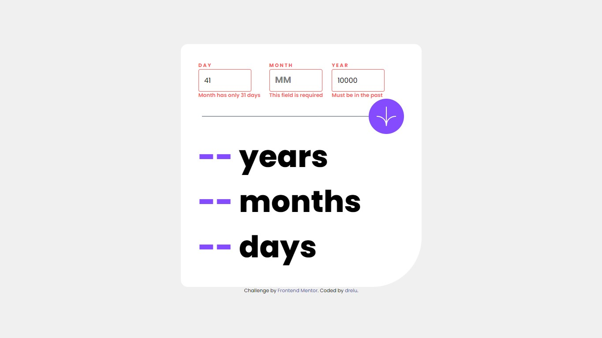
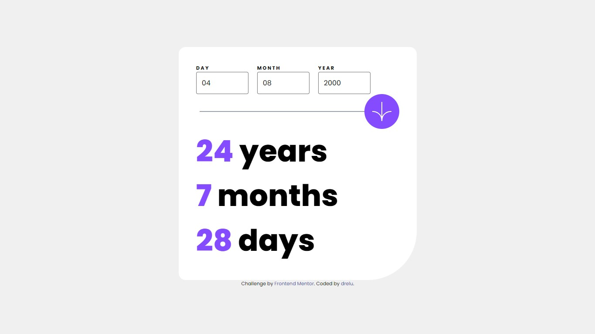
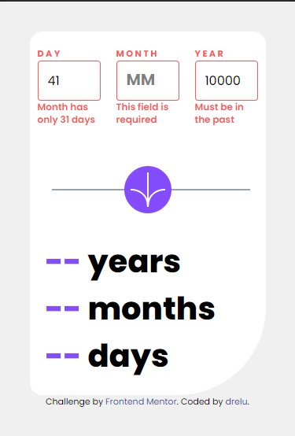

# Frontend Mentor - Age calculator app solution

This is a solution to the [Age calculator app challenge on Frontend Mentor](https://www.frontendmentor.io/challenges/age-calculator-app-dF9DFFpj-Q). Frontend Mentor challenges help you improve your coding skills by building realistic projects. 

## Table of contents

- [Overview](#overview)
  - [The challenge](#the-challenge)
  - [Screenshot](#screenshot)
  - [Links](#links)
- [My process](#my-process)
  - [Built with](#built-with)
  - [What I learned](#what-i-learned)
  - [Continued development](#continued-development)
  - [Useful resources](#useful-resources)
- [Author](#author)

## Overview

### The challenge

Users should be able to:

- View an age in years, months, and days after submitting a valid date through the form
- Receive validation errors if:
  - Any field is empty when the form is submitted
  - The day number is not between 1-31
  - The month number is not between 1-12
  - The year is in the future
  - The date is invalid e.g. 31/04/1991 (there are 30 days in April)
- View the optimal layout for the interface depending on their device's screen size
- See hover and focus states for all interactive elements on the page

### Screenshot

### Links

- Solution URL: [Github](https://github.com/dreelu/age-calculator-app)
- Live Site URL: [Github Pages](https://dreelu.github.io/age-calculator-app/src)

## My process

### Built with

- JavaScript
- Semantic HTML5 markup
- CSS custom properties
- Tailwind CSS
- Flexbox

### What I learned

This is my first project using JavaScript, so I've obviously learned a lot about it. It doesn't seem as difficult as I expected, and to be honest, I really enjoyed it. I'm very happy with my capabilities and feel like I'm starting to get really good at what I do.

### Continued development

I really want to learn more about JavaScript frameworks and APIs. It's a concept I've heard a lot about and when I found out what it means, it blew my mind. The possibilities are endless and I'd love to work with them as soon as possible!!

### Useful Resources

 - First of all, I want to make it clear that I don't let AI do my job. I use it as if I were a senior dev, and I can answer questions like "How to use xyz in Tailwind" or "My body isn't scrolling. What do you think can be done?". Artificial intelligence is an extremely powerful tool when used well. If you don't want it to replace your work, don't take the first step.

## Author

- Frontend Mentor - [@dreelu](https://www.frontendmentor.io/profile/dreelu)
- Twitter - [@dreelu](https://www.twitter.com/dreelu)
